# System Overview

This page gives a high-level view of the Immunisation FHIR API runtime architecture.

It focuses on the API path, batch ingestion path, outbound notification flow, runtime configuration, and NHS number change handling.

## High-Level Diagram

```mermaid
flowchart LR
    subgraph Ingress[Ingress and API]
        Suppliers[Supplier systems] --> Apigee[Apigee proxy\nOAuth, rate limiting, supplier header]
        Apigee --> ApiGw[AWS API Gateway HTTP API]
        ApiGw --> Backend[Backend API Lambdas\nCRUD, search, status]
        Backend --> IEDS[(IEDS DynamoDB\nImmunisation event store)]
    end

    subgraph Batch[Batch ingestion]
        SupplierFiles[Supplier batch files in S3] --> Filename[Filename Processor Lambda]
        Mesh[MESH mailbox bucket] --> MeshProc[Mesh Processor Lambda]
        MeshProc --> Filename
        Filename --> BatchCreated[SQS FIFO\nbatch-file-created]
        BatchCreated --> BatchFilter[Batch Processor Filter Lambda]
        BatchFilter --> SupplierQueue[SQS FIFO\nsupplier metadata queue]
        SupplierQueue --> BatchPipe[EventBridge Pipe]
        BatchPipe --> RecordProcessor[ECS Fargate Record Processor]
        RecordProcessor --> Kinesis[Kinesis data stream]
        Kinesis --> Forwarder[Record Forwarder Lambda]
        Forwarder --> IEDS
        Forwarder --> AckQueue[SQS FIFO\nack metadata queue]
        AckQueue --> Ack[Ack Backend Lambda]
    end

    subgraph Outbound[Outbound notifications]
        IEDS -->|DynamoDB stream| Delta[Delta Lambda]
        Delta --> DeltaTable[(Delta DynamoDB)]
        DeltaTable -->|DynamoDB stream| MnsPipe[EventBridge Pipe]
        MnsPipe --> MnsQueue[SQS\nmns-outbound-events]
        MnsQueue --> MnsPublisher[MNS Publisher Lambda]
        MnsPublisher --> Subscribers[MNS subscribers]
    end

    subgraph Config[Runtime config]
        ConfigBucket[S3 config bucket] --> RedisSync[Redis Sync Lambda]
        RedisSync --> Redis[(Redis cache\npermissions, disease mappings, config)]
        Redis --> Backend
        Redis --> Filename
        Redis --> RecordProcessor
        Redis --> Forwarder
    end

    subgraph IdSync[Identity sync]
        MnsIdEvent[MNS NHS number change event] --> IdQueue[SQS\nid-sync-queue]
        IdQueue --> IdSyncLambda[ID Sync Lambda]
        IdSyncLambda --> IEDS
    end
```

## Key Runtime Stores

| Store          | Purpose                                                             |
| -------------- | ------------------------------------------------------------------- |
| IEDS DynamoDB  | System of record for immunisation events                            |
| Delta DynamoDB | Outbound change store derived from IEDS stream events               |
| Redis          | Runtime cache for permissions, disease mappings, and related config |
| Audit table    | Batch-processing control state, deduplication, and status tracking  |

## Design Notes

- The filename processor is the batch entry point for files placed in the source bucket.
- The audit table is for deduplication, processing state, and ordering decisions.
- The batch processor filter ensures only one event is processed at a time for a given supplier and vaccine-type combination.
- The supplier metadata FIFO queue preserves ordering before work is dispatched to ECS through EventBridge Pipe.
- ECS is used for record processing because batch row processing can be long-running.
- The record forwarder is the component that applies processed batch changes to IEDS.
- ACK creation is part of the batch lifecycle.
