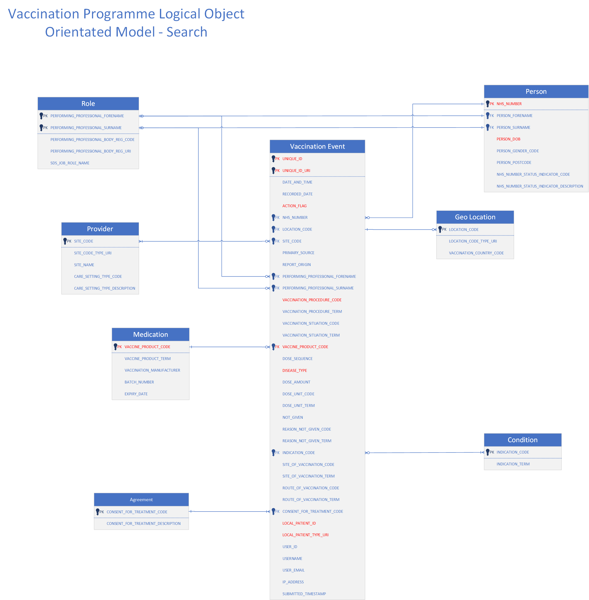

## Access Pattern

We receive Immunisation Events in json format via our API. Each message contains inlined resources i.e. it doesn't
contain a reference/link to a preexisting resource. For example, a vaccination event contains the full patient resource
embedded in it. This means our backend doesn't assume Patient as a separate resource but rather, part of the message
itself. This is the same for other resources included in the resource like address, location etc.

* **Creating an event:** Add the entire message in an attribute so, it can be retrieved. This attribute has the entire
  original message with no changes. The event-id must be contained in the message itself. Our backend won't create the
  id. **This is our main index.** and it doesn't contain any sort-key
* **Retrieve an event:** The simplest form is by id; `GET /event/{id}`. This access pattern should always result in
  either one resource or none
* **Search:** This pattern can be broken down into two main categories. Queries that retrieve events with a known
  patient and, queries that retrieve events with particular set of search criteria.

### Patient

One index is dedicated to search patient. This will satisfy
the `/event?NhsNumber=1234567,dateOfBirth=01/01/1970,diseaseTypeFilter=covid|flu|mmr|hpv|polio` endpoint.
The `NhsNumber` is our PK and the SK has `<dateOfBirth>#<diseaseType>#<eventId>` format. **This means, in order to
filter based on `diseaseType`, `dateOfBirth` must be known. We can filter based on only `nhsNumber` and `diseaseType`
but that requires an attribute filter.

**Q:** Do we need to retrieve events based on only NHS number and Disease Type? i.e. is this a valid
request? `GET /event?NhsNumber=1234567,diseaseTypeFilter=covid`
**Q:** What is LocalPatient? In our sample data we have both ID and System values, but we don't have any access pattern
for it.

### Vaccination

The provided object relational model, has a few highlighted fields related to vaccination but, we don't have any search
criteria for them. We can create one or more indices to address different search requests but, we need to know in
advance what they are.

For example, one access pattern can be `PK: DiseaseType` and `SK: <vacc_procedure>#<vacc_product>#<event_id>`. This will
be similar to the patient access pattern.

**Q:** What are search criteria for vaccination related fields?

## Field mappings

Given the relational model (below image) and `sample_event.json` below is our field mappings for highlighted fields:

* `UNIQUE_ID -> $["identifier"][0]["value"]`
* `UNIQUE_ID_URI -> $["identifier"][0]["system"]`
* `ACTION_FLAG -> ?????`
* `VACCINATION_PROCEDURE_CODE -> $["extension"][0]["valueCodeableConcept"]["coding"][0]["code"]`
* `VACCINATION_PRODUCT_CODE -> $["vaccineCode"]["coding"][0]["code"]`
* `DISEASE_TYPE -> $["protocolApplied"][0]["targetDisease"][0]["coding"][0]["code"]`
* `LOCAL_PATIENT_ID -> $["contained"][0]["item"][3]["answer"][0]["valueCoding"]["code"]`
* `LOCAL_PATIENT_TYPE_URI -> $["contained"][0]["item"][3]["answer"][0]["valueCoding"]["system"]`

TODO: write the rest of the mappings.

**Q**: What does this
mean: [[first point in Overview]](https://nhsd-confluence.digital.nhs.uk/display/Vacc/Immunisation+FHIR+API+-+IEDS+Data+Model)
> This data model must include backwards compatibility with the legacy CSV process to account for business continuity

## Error Scenarios

We assume all error responses will be of type `OperationOutcome`. We can break down scenarios in three categories. One
group is errors that are generated and dealt with in the Proxy before reaching to our backend.
Authentication/authorisation errors belong to this group.

A second group is related to both fine and coarse validation errors.

* **Q:** What is expected in the response message? A detailed diagnostics of the validation or just a generic error?

The third group is anything related to the backend itself. `404` and, catch-all exceptions in the source code (like
malformed json for example)
