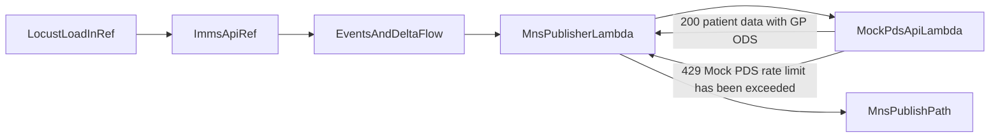

# Plan: Performance test MNS with mocked PDS in ref

## Objectives

- Provide a **mocked PDS Lambda/service** in `ref` so MNS flows can retrieve required patient/GP (ODS) data without calling real PDS.
- Enforce and validate rate limits aligned to acceptance criteria:
    - average threshold: `125 rps`
    - spike threshold: `450 rps`
    - overflow response: HTTP `429`, body/message `Mock PDS rate limit has been exceeded`
- Run repeatable load tests to determine current throughput ceiling and failure characteristics for campaign peaks.

## Existing architecture to leverage

- MNS publisher resolves GP data via shared PDS client in [`/Users/thomasboyle/Documents/VEDS Immunisation FHIR API/immunisation-fhir-api/lambdas/shared/src/common/api_clients/get_pds_details.py`](/Users/thomasboyle/Documents/VEDS Immunisation FHIR API/immunisation-fhir-api/lambdas/shared/src/common/api_clients/get_pds_details.py) and [`/Users/thomasboyle/Documents/VEDS Immunisation FHIR API/immunisation-fhir-api/lambdas/shared/src/common/api_clients/pds_service.py`](/Users/thomasboyle/Documents/VEDS Immunisation FHIR API/immunisation-fhir-api/lambdas/shared/src/common/api_clients/pds_service.py).
- Notification payload construction (including GP ODS use) is in [`/Users/thomasboyle/Documents/VEDS Immunisation FHIR API/immunisation-fhir-api/lambdas/mns_publisher/src/create_notification.py`](/Users/thomasboyle/Documents/VEDS Immunisation FHIR API/immunisation-fhir-api/lambdas/mns_publisher/src/create_notification.py).
- Ref-targeted performance tooling already exists in Locust at [`/Users/thomasboyle/Documents/VEDS Immunisation FHIR API/immunisation-fhir-api/tests/perf_tests/src/locustfile.py`](/Users/thomasboyle/Documents/VEDS Immunisation FHIR API/immunisation-fhir-api/tests/perf_tests/src/locustfile.py).

## Delivery approach

1. **Introduce Mock PDS API Lambda**
    - Add a dedicated Lambda that returns deterministic Patient payloads containing required demographic + GP ODS fields for NHS number lookup.
    - Support two behaviors via env/config:
        - normal mode: return valid mock PDS patient data
        - throttled mode: return `429` once configured limit is exceeded
    - Keep schema compatible with current parser paths in MNS/id-sync code to avoid functional drift.

2. **Wire ref to mock endpoint, keep other envs safe**
    - Add infra for mock PDS API (Lambda + API Gateway route) in instance modules.
    - In `ref` tfvars, route `PDS_ENV`/PDS base URL resolution to the mock endpoint only.
    - Preserve existing behavior for non-ref environments unless explicitly configured.

3. **Implement rate-limiting policy in mock**
    - Use API Gateway throttling and/or in-Lambda token-bucket counters (final choice based on easiest deterministic assertion in tests) to guarantee:
        - sustained traffic over `125 rps` observable as throttling trend
        - spike over `450 rps` promptly returns `429`
    - Standardize response body contract: `{ "code": 429, "message": "Mock PDS rate limit has been exceeded" }`.

4. **Add automated validation tests**
    - Unit tests for mock response shape and error contract.
    - Integration tests for MNS publisher path proving:
        - Scenario 1: required PDS data is returned in ref via mock (including ODS usage path)
        - Scenario 2: limit breaches produce `429` with expected message.

5. **Extend perf tests for campaign-style load**
    - Add Locust scenarios to drive traffic profiles around:
        - baseline (`~125 rps`)
        - spike (`>450 rps` burst)
        - stepped ramp (to identify knee point and failure ratio)
    - Capture and report: success %, 429 %, latency p50/p95/p99, and MNS publish success under each load shape.

6. **Operational guardrails and rollout**
    - Add runbook notes in existing perf test docs for executing ref tests safely.
    - Ensure alarms/log queries identify throttle onset and downstream effects in MNS publisher.
    - Keep mock enabled as mandatory integration path while real PDS endpoint is off-limits.

## Suggested implementation sequence by file area

- Shared PDS client behavior switch:
    - [`/Users/thomasboyle/Documents/VEDS Immunisation FHIR API/immunisation-fhir-api/lambdas/shared/src/common/api_clients/pds_service.py`](/Users/thomasboyle/Documents/VEDS Immunisation FHIR API/immunisation-fhir-api/lambdas/shared/src/common/api_clients/pds_service.py)
    - [`/Users/thomasboyle/Documents/VEDS Immunisation FHIR API/immunisation-fhir-api/lambdas/shared/src/common/api_clients/get_pds_details.py`](/Users/thomasboyle/Documents/VEDS Immunisation FHIR API/immunisation-fhir-api/lambdas/shared/src/common/api_clients/get_pds_details.py)
- New mock PDS lambda + tests under `lambdas/` (new module mirrored to existing lambda structure).
- Infra wiring (API/Lambda/env mapping):
    - [`/Users/thomasboyle/Documents/VEDS Immunisation FHIR API/immunisation-fhir-api/infrastructure/instance`](/Users/thomasboyle/Documents/VEDS Immunisation FHIR API/immunisation-fhir-api/infrastructure/instance)
    - [`/Users/thomasboyle/Documents/VEDS Immunisation FHIR API/immunisation-fhir-api/infrastructure/instance/environments/dev/ref/variables.tfvars`](/Users/thomasboyle/Documents/VEDS Immunisation FHIR API/immunisation-fhir-api/infrastructure/instance/environments/dev/ref/variables.tfvars)
- Perf scripts/docs:
    - [`/Users/thomasboyle/Documents/VEDS Immunisation FHIR API/immunisation-fhir-api/tests/perf_tests/src/locustfile.py`](/Users/thomasboyle/Documents/VEDS Immunisation FHIR API/immunisation-fhir-api/tests/perf_tests/src/locustfile.py)
    - [`/Users/thomasboyle/Documents/VEDS Immunisation FHIR API/immunisation-fhir-api/tests/perf_tests/README.md`](/Users/thomasboyle/Documents/VEDS Immunisation FHIR API/immunisation-fhir-api/tests/perf_tests/README.md)
    - [`/Users/thomasboyle/Documents/VEDS Immunisation FHIR API/immunisation-fhir-api/tests/perf_tests/Makefile`](/Users/thomasboyle/Documents/VEDS Immunisation FHIR API/immunisation-fhir-api/tests/perf_tests/Makefile)

## Flow diagram

## Acceptance criteria mapping

- **Scenario 1:** mock service in `ref` returns required patient data for MNS publishing path, including GP ODS extraction path.
- **Scenario 2:** calls above configured `450 rps` (and sustained over `125 rps`) return HTTP `429` with exact message contract.
- **Outcome:** measured traffic limits and failure envelope documented from repeatable load profiles for Autumn/Spring campaign readiness decisions.
